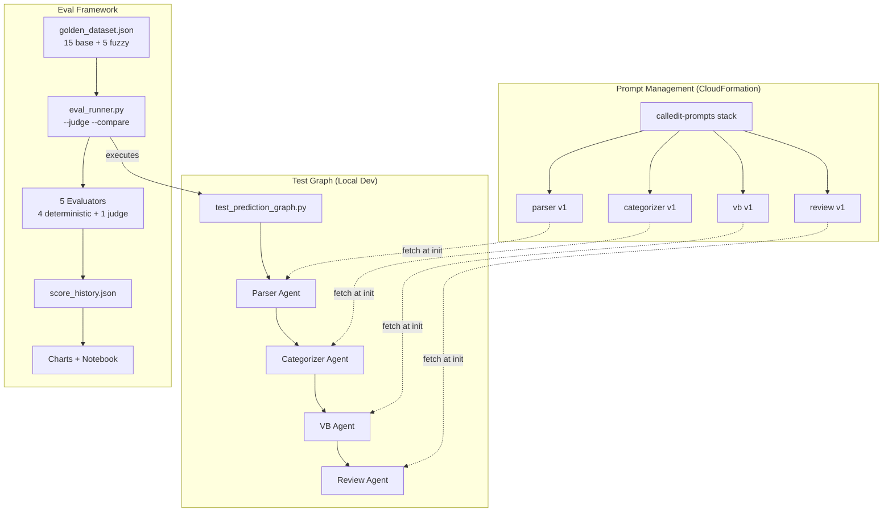

# Project Update 06 — Eval Framework Execution & Baseline Results

**Date:** March 14, 2026
**Context:** Execution of the prompt evaluation framework (Spec 5), establishing system baseline
**Audience:** Future self for project narrative; next agent for context pickup

### Referenced Kiro Specs
- `.kiro/specs/prompt-eval-framework/` — Spec 5: Prompt Evaluation Framework
  - `requirements.md` — COMPLETE (9 requirements, revised for 3-service architecture)
  - `design.md` — COMPLETE (7 components, 16 correctness properties)
  - `tasks.md` — COMPLETE (all required tasks executed)

### Prerequisite Reading
- `docs/project-updates/05-project-update-eval-strategy.md` — Strategy decisions and architecture

---

## What Was Built

### Phase 0: Foundation
- Feature branch `feature/prompt-eval-framework`
- Standalone test graph (`test_prediction_graph.py`) — synchronous execution without SnapStart/Lambda/WebSocket, same agent factory functions as production
- Key learning: importing `prediction_graph.py` triggers the module-level singleton which reads DynamoDB tool registry. Solved by inlining parse functions.

### Phase 1: OTEL Instrumentation
- `otel_instrumentation.py` — Strands SDK has native OTEL support via `StrandsTelemetry`. Auto-creates spans per agent with token counts, model IDs, timing.
- Our module adds: graph-level parent span, prompt version manifest as custom attributes, init/export helpers
- SnapStart `after_restore` hook extended for OTEL collector state restoration
- Console exporter verified end-to-end with real Bedrock calls

### Phase 2: Bedrock Prompt Management
- `prompt_client.py` — fetches versioned prompts from Bedrock, falls back to bundled constants
- All 4 agent factory functions migrated to try Prompt Management first
- CloudFormation stack `calledit-prompts` deployed with 4 `AWS::Bedrock::Prompt` + 4 `AWS::Bedrock::PromptVersion` resources
- Template at `infrastructure/prompt-management/template.yaml`
- Prompt IDs: parser=RBR4QBAQPY, categorizer=C320LUMT9V, vb=EBBKNNH2GI, review=1MJYEPTLZL
- All at v1 (initial migration from hardcoded constants)
- Categorizer uses `{{tool_manifest}}` Bedrock variable for dynamic tool awareness

### Phase 3: Golden Dataset & Evaluators
- `golden_dataset.py` — schema, loader, validator, filter
- `eval/golden_dataset.json` — 15 base predictions + 5 fuzzy predictions
  - Categories: 6 auto_verifiable, 5 automatable, 4 human_only
  - 3 fuzzy predictions where clarification improves precision without changing category (human_only stays human_only)
- 5 evaluators in `evaluators/` package:
  - **Tier 1 (deterministic):** CategoryMatch, JSONValidity, Convergence, ClarificationQuality
  - **Tier 2 (LLM-as-judge):** ReasoningQuality (Opus 4.6 as judge)
- `eval_runner.py` — CLI with `--layer`, `--category`, `--difficulty`, `--name`, `--dry-run`, `--judge`, `--compare`
- `online_eval.py` — deterministic session sampling via SHA256 hash

### Phase 4: Score Tracking & Visualization
- `score_history.py` — atomic JSON append, comparison with delta indicators, prompt version correlation
- `eval/generate_charts.py` — 4 static PNG dashboards (score_trends, heatmap, fuzzy_convergence, agent_health)
- `eval/eval_explorer.ipynb` — interactive Jupyter notebook with 5 analysis sections

---

## Baseline Results

### Run 1: No tool manifest (60% pass rate)
- auto_verifiable: 33% (categorizer couldn't see web_search tool)
- automatable: 100%
- human_only: 100%
- **Root cause:** eval runner wasn't passing tool_manifest from golden dataset to test graph

### Run 2: With tool manifest fix (80% pass rate)
- auto_verifiable: 33% → 100% ↑
- automatable: 100% → 80% ↓ (base-012 DR baseball classified as auto_verifiable with web_search)
- human_only: 100%
- **Insight:** tool manifest injection works; one edge case where web_search makes the categorizer over-confident

### Run 3: With Opus 4.6 judge (30% pass rate — by design)
- Deterministic scores unchanged from Run 2
- Judge scores revealed:
  - Categorizer reasoning: strong (0.85-1.0) — sound, specific reasoning
  - Verification builder: consistently good (0.75-0.95) — actionable steps
  - **ReviewAgent questions: weak (0.3-0.55)** — generic questions that don't target prediction-specific ambiguity
- **Key finding:** The ReviewAgent prompt is the primary improvement target

### What the Judge Caught That Deterministic Scoring Missed

| Test Case | Deterministic | Judge | Judge's Insight |
|---|---|---|---|
| base-001 (sunrise) | PASS | Review: 0.4 | "Questions could apply to virtually any prediction about an event in NYC" |
| base-003 (70°F Central Park) | PASS | Review: 0.3 | "Overly generic and pedantic, focusing on minor technicalities" |
| base-006 (iPhone Sept) | PASS | Categorizer: 0.2 | "Reasoning contradicts its own classification" — temporal verification issue |

---

## Architecture Diagram (As Built)

---

## Decision Log

### Decision 27: Opus 4.6 as Judge Model
- Opus 4 marked Legacy (15-day inactivity). Opus 4.6 model ID initially invalid (`us.anthropic.claude-opus-4-6-v1:0`), works without `:0` suffix (`us.anthropic.claude-opus-4-6-v1`)
- Different model generation than agents (Sonnet 4) — avoids self-evaluation bias
- Dev-time tool, not production — latency/cost not a constraint

### Decision 28: CloudFormation for Prompt Management (not console, not boto3 script)
- IaC ensures reproducibility and auditability
- Separate stack (`calledit-prompts`) from SAM backend — prompts are shared infrastructure
- Template at `infrastructure/prompt-management/template.yaml`
- Future: when dev/prod stacks split, both read from the same prompt stack

### Decision 29: Local eval results (not DynamoDB — yet)
- `score_history.json` tracked in git (portfolio evidence)
- `eval/reports/` gitignored (large, regenerable)
- Charts tracked in git (visual portfolio evidence)
- Will move to DynamoDB/S3 when building the AgentCore eval stack (no local filesystem on Lambda)

### Decision 30: Two-tier evaluator strategy validated
- Tier 1 (deterministic) catches structural regressions fast and cheap
- Tier 2 (LLM-as-judge) catches nuanced quality issues deterministic scoring misses
- The 80% → 30% pass rate drop when adding the judge proves the judge adds real signal
- ReviewAgent prompt is the primary improvement target based on judge data

---

## What the Next Agent Should Do

1. Deep review and expansion of the golden dataset — comprehensive coverage across domains, multiple fuzziness levels
2. Iterate on the ReviewAgent prompt using eval data to guide improvements
3. Consider golden dataset versioning strategy (git vs DynamoDB vs S3)
4. Future spec: AgentCore Evaluations integration (register custom evaluators, online eval, DynamoDB for results)
5. Future spec: CDK eval stack (parallel to production, no SnapStart)

---

## Files Created/Modified

### New Files
- `backend/calledit-backend/handlers/strands_make_call/test_prediction_graph.py` — standalone test graph
- `backend/calledit-backend/handlers/strands_make_call/otel_instrumentation.py` — OTEL init + graph spans
- `backend/calledit-backend/handlers/strands_make_call/prompt_client.py` — Bedrock Prompt Management client
- `backend/calledit-backend/handlers/strands_make_call/golden_dataset.py` — schema, loader, filter
- `backend/calledit-backend/handlers/strands_make_call/evaluators/__init__.py`
- `backend/calledit-backend/handlers/strands_make_call/evaluators/category_match.py`
- `backend/calledit-backend/handlers/strands_make_call/evaluators/json_validity.py`
- `backend/calledit-backend/handlers/strands_make_call/evaluators/convergence.py`
- `backend/calledit-backend/handlers/strands_make_call/evaluators/clarification_quality.py`
- `backend/calledit-backend/handlers/strands_make_call/evaluators/reasoning_quality.py`
- `backend/calledit-backend/handlers/strands_make_call/eval_runner.py` — CLI eval runner
- `backend/calledit-backend/handlers/strands_make_call/online_eval.py` — session sampling
- `backend/calledit-backend/handlers/strands_make_call/score_history.py` — score tracking + regression detection
- `eval/golden_dataset.json` — 15 base + 5 fuzzy test predictions
- `eval/generate_charts.py` — static chart generator
- `eval/eval_explorer.ipynb` — interactive Jupyter notebook
- `infrastructure/prompt-management/template.yaml` — CloudFormation for Bedrock prompts

### Modified Files
- `backend/calledit-backend/handlers/strands_make_call/parser_agent.py` — fetch from Prompt Management
- `backend/calledit-backend/handlers/strands_make_call/categorizer_agent.py` — fetch from Prompt Management
- `backend/calledit-backend/handlers/strands_make_call/verification_builder_agent.py` — fetch from Prompt Management
- `backend/calledit-backend/handlers/strands_make_call/review_agent.py` — fetch from Prompt Management
- `backend/calledit-backend/handlers/strands_make_call/snapstart_hooks.py` — OTEL restore hook
- `requirements.txt` — strands-agents[otel], opentelemetry packages
- `backend/calledit-backend/handlers/strands_make_call/requirements.txt` — same
- `.gitignore` — eval/reports/
