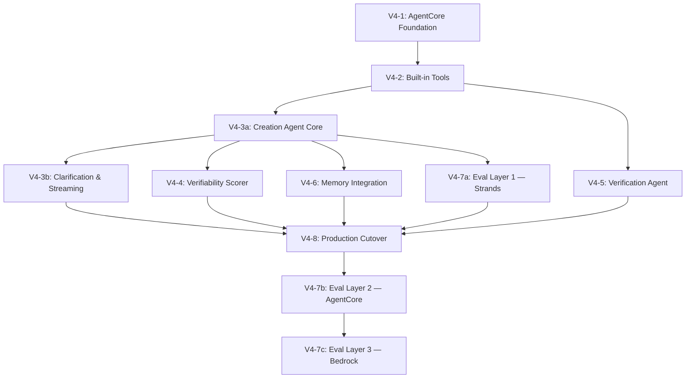

# Project Update 20 — v4 AgentCore Architecture Planning

**Date:** March 22, 2026
**Context:** Planned the v4 clean rebuild on Amazon Bedrock AgentCore. Three architectural insights, two-agent design, hybrid memory model, verifiability strength score, three-layer eval architecture. Also fixed Prompt Management versions and ran serial baseline eval.
**Audience:** Future self for project narrative; next agent for context pickup
**Git Commit:** Pending

### Referenced Kiro Specs
- No new specs created yet — this is the planning session before spec creation
- `.kiro/specs/verification-eval-integration/` — Spec B3 (COMPLETE, prerequisite context)

### Prerequisite Reading
- `docs/project-updates/19-project-update-spec-b3-verification-eval-integration.md` — Spec B3 (what just happened)
- `docs/project-updates/v4-agentcore-architecture.md` — Full v4 architecture reference doc
- `docs/project-updates/decision-log.md` — Decisions through 91

---

## What Happened This Session

### Prompt Management Fix
Discovered that Verification Builder v3 and Review v4 prompt versions never actually existed in Bedrock Prompt Management. The CloudFormation template had the right text, but the `PromptVersion` resources didn't create the versions — the DRAFT was never updated with the tool-aware content. All eval runs since Spec A2 had been running on hardcoded fallback constants (which had the correct text, so results were valid).

Fixed by redeploying the prompt stack:
```bash
cd infrastructure/prompt-management && aws cloudformation deploy --template-file template.yaml --stack-name calledit-prompts
```

Verified VB v3 and Review v4 now exist. Future eval runs will show `"vb": "3", "review": "4"` instead of `"fallback"`.

### Serial Baseline Eval (Run 17)
Ran full serial baseline with judge, pinned prompts (parser=1, categorizer=2, VB=3, review=4). Results within noise of Run 15 — baseline is stable. Tool-aware prompts didn't regress prediction pipeline quality. Logged as Run 17 in eval-run-log.md. Single backend run still in progress at time of writing.

### Three Architectural Insights for v4

The conversation surfaced three fundamental rethinks of the CalledIt architecture:

**Insight 1: Two Agents, Shared Infrastructure.** The creation agent and verification agent share the same domain but have fundamentally different jobs. Creation is collaborative and user-facing. Verification is investigative and autonomous. They share the same model, tools (via Gateway), DDB table, and Prompt Management — but are separate AgentCore Runtime deployments with separate prompts, scaling, and observability. This aligns with AgentCore's multi-agent pattern (orchestrator + specialist as separate runtimes).

**Insight 2: Verifiability Strength Score, Not Categories.** The 3-category system (auto_verifiable / automatable / human_only) is replaced by a continuous 0.0-1.0 score — like a password strength indicator. Green (0.8-1.0), Yellow (0.5-0.79), Red (0.0-0.49). The user sees this after round 1 and can choose to clarify to improve the score. This gives the user agency and eliminates the false confidence of binary category labels.

**Insight 3: Three-Layer Eval Architecture.** Strands Evals SDK for dev-time (inner loop, minutes), AgentCore Evaluations for deployed agents (bridge, span-level analysis), Bedrock Evaluations for production (outer loop, LLM-as-judge at scale + human eval). The dashboard hero page shows the full lifecycle: experiment → deployment → production confidence.

### Two-Agent Design Decision
Discussed whether creation and verification should be one agent with a mode flag or two separate agents. Decided on two separate agents based on: different prompts (collaborative vs investigative), different memory needs (creation needs STM+LTM, verification is DDB-driven with optional Memory enrichment), different scaling profiles (user-facing vs batch), different observability needs. This matches AgentCore's recommended multi-agent pattern.

### Hybrid Memory Model
The most significant architectural decision of the session. Prediction data lives in two stores:

- **DynamoDB** — the structured prediction bundle (exact JSON fields: parsed_claim, verification_plan, verifiability_score). This is the precise contract between creation and verification agents. Loaded by exact prediction_id lookup.
- **AgentCore Memory** — conversational context and user preferences. Three LTM strategies: semantic (prediction facts for cross-prediction learning), user preferences (timezone, sports teams, weather thresholds), session summaries (clarification round context). The verification agent optionally enriches its DDB bundle with Memory context.

This hybrid approach uses each store for its strength: DDB for precision, Memory for fuzzy recall and cross-session learning. Neither alone would be sufficient.

### AgentCore Steering Doc Created
Created `.kiro/steering/agentcore-architecture.md` with:
- Pushback protocol (agent must flag deviations from AgentCore patterns)
- Six core patterns we follow
- Three documented deviations with rationale
- Anti-patterns to avoid
- Three-layer eval requirements

### PE Interview Prep Doc
Created `docs/calledit-pe-perspective.md` — a standalone presentation artifact framing the project from a PE AI Solutions Architect perspective. Includes mermaid diagrams for architecture evolution, AWS service map, agent pipeline, eval framework, and migration path.

## Decisions Made

- Decision 86: Two separate AgentCore Runtime deployments (creation agent + verification agent) instead of one agent with mode flag. Different prompts, memory needs, scaling profiles, and observability requirements justify separate deployments. Aligns with AgentCore multi-agent pattern.
- Decision 87: Replace 3-category system with continuous verifiability strength score (0.0-1.0). Green/yellow/red indicator gives users agency to improve prediction quality through clarification rounds.
- Decision 88: Hybrid Memory Model — DynamoDB for structured prediction bundles (precise contract), AgentCore Memory for conversational context and user preferences (fuzzy recall + cross-session learning). Neither alone is sufficient.
- Decision 89: Three-layer eval architecture — Strands Evals SDK (inner loop), AgentCore Evaluations (bridge), Bedrock Evaluations (outer loop). Dashboard hero page shows full lifecycle.
- Decision 90: No hardcoded prompt fallbacks in v4. If Prompt Management is unavailable, the agent fails clearly. Silent fallback to stale prompts is worse than a visible failure.
- Decision 91: AgentCore built-in tools (Browser + Code Interpreter) replace local MCP subprocesses. Eliminates the 30-second cold start. Gateway reserved for Phase 2 domain-specific APIs (superseded by Decision 93 for Day 1 tooling).
- Decision 92: Split v4 into 11 focused specs for 90%+ confidence. Same reasoning as Decision 3 (Spec 1/2 split), Decision 64 (A1/A2 split), and Decision 75 (B1/B2/B3 split). V4-3 (Creation Agent) split into core + clarification. V4-7 (Three-Layer Eval) split into one spec per layer.
- Decision 93: Built-in tools first, Gateway later. Start with AgentCore Browser + Code Interpreter (zero external dependencies, zero API keys, zero Gateway setup). Add Gateway with domain-specific APIs (Brave, Alpha Vantage, weather, sports) only when built-in tools become a bottleneck for specific prediction domains. Build smarter, not harder.
- Decision 94: Single agent, multi-turn prompts for the creation agent. One Strands Agent with 4 sequential prompt turns (parse → build plan → score → review), each a separate versioned prompt in Prompt Management. Chosen based on experimental data: 16 eval runs showed multi-turn matches serial graph on all reasoning metrics while eliminating the silo problem. Per-step observability via AgentCore spans. 92% confidence.
- Decision 95: Parallel run then phased teardown. v3 stays live and untouched through V4-1 to V4-7a. V4-8 handles cutover in three phases: parallel run (compare v3 vs v4 via eval), traffic switch (frontend to v4, v3 as rollback), v3 teardown (delete SAM stack, keep shared DDB/Cognito/Prompt Management). v3 predictions in DDB handled gracefully by v4 verification agent.

## v4 Spec Plan — 11 Specs

The v4 rebuild is split into 11 focused specs, each independently deployable and testable. This follows the project's established pattern: smaller specs = higher confidence (Decision 3, 64, 75).

### Spec Dependency Graph



### Spec Details

| Spec | Name | Reqs | Tasks (est.) | Confidence | Depends On | Delivers |
|------|------|------|-------------|-----------|-----------|---------|
| V4-1 | AgentCore Foundation | 4 | 8-10 | 95% | Nothing | `agentcore create`, dev server, basic invoke, config |
| V4-2 | Built-in Tools | 3 | 6-8 | 95% | V4-1 | AgentCore Browser + Code Interpreter wired to agent, basic verification working |
| V4-3a | Creation Agent Core | 3 | 8-10 | 92% | V4-2 | Prediction in → bundle out. Prompt Management. DDB save. |
| V4-3b | Clarification & Streaming | 3 | 8-10 | 90% | V4-3a | Multi-round clarification, WebSocket streaming, frontend wiring |
| V4-4 | Verifiability Scorer | 3 | 6-8 | 95% | V4-3a | Continuous 0.0-1.0 score, 5 dimensions, frontend indicator |
| V4-5 | Verification Agent | 4 | 8-10 | 90% | V4-2 | Separate runtime, DDB bundle load, Browser + Code Interpreter execution, verdict, EventBridge |
| V4-6 | Memory Integration | 4 | 8-10 | 88% | V4-3a | STM + 3 LTM strategies, session manager, verification enrichment |
| V4-7a | Eval Layer 1 (Strands) | 3 | 8-10 | 92% | V4-3a | Golden dataset adapted, evaluators for two agents, local eval runner |
| V4-7b | Eval Layer 2 (AgentCore) | 3 | 8-10 | 88% | V4-7a, V4-8 | Span-level eval, online scoring, on-demand eval, dashboard Layer 2 panel |
| V4-7c | Eval Layer 3 (Bedrock) | 3 | 6-8 | 88% | V4-7b | LLM-as-judge at scale, custom metrics, human eval, dashboard Layer 3 panel |
| V4-8 | Production Cutover | 3 | 6-8 | 92% | V4-3b, V4-4, V4-5, V4-6, V4-7a | Three-phase cutover: parallel run (v3+v4), traffic switch, v3 teardown. Keep DDB/Cognito/Prompt Mgmt shared. v3 predictions handled gracefully (Decision 95) |

**Totals:** 36 requirements, ~80-92 tasks, 11 specs, all ≥88% confidence.

### Critical Path
V4-1 → V4-2 → V4-3a → V4-3b/V4-4/V4-5 (parallel) → V4-6 → V4-7a → V4-8 → V4-7b → V4-7c

### Parallelization Opportunities
After V4-3a completes, four specs can proceed in parallel:
- V4-3b (clarification + streaming)
- V4-4 (verifiability scorer)
- V4-5 (verification agent — only needs V4-2, not V4-3a)
- V4-7a (eval Layer 1)

V4-6 (memory) can also start after V4-3a but may benefit from V4-3b being done first (clarification rounds are the primary STM use case).

### Why 11 Specs, Not Fewer
The two highest-risk areas were split:
- **V4-3 (Creation Agent)** split into V4-3a (core: prediction in → bundle out) and V4-3b (interactive: clarification + streaming). If V4-3a works but V4-3b has issues, you still have a working prediction agent.
- **V4-7 (Three-Layer Eval)** split into one spec per layer. Each layer has different dependencies: Layer 1 needs only agent code (local), Layer 2 needs deployed agents, Layer 3 needs production traffic. Natural split points.

## Files Created/Modified

### Created
- `docs/project-updates/v4-agentcore-architecture.md` — Full v4 architecture reference doc with mermaid diagrams
- `docs/project-updates/20-project-update-v4-agentcore-architecture-planning.md` — This file
- `docs/project-updates/21-project-update-post-b3-eval-analysis.md` — Placeholder for eval analysis (pending runs)
- `docs/project-updates/bedrock-capability-assessment.md` — Feature-by-feature Bedrock assessment with verdicts
- `docs/calledit-pe-perspective.md` — PE interview presentation artifact
- `.kiro/steering/agentcore-architecture.md` — AgentCore architecture standards and pushback protocol
- `.kiro/specs/agentcore-foundation/requirements.md` — V4-1 requirements (4 requirements, 15 acceptance criteria)
- `.kiro/specs/agentcore-foundation/design.md` — V4-1 design (architecture, entrypoint pattern, 4 correctness properties)
- `.kiro/specs/agentcore-foundation/tasks.md` — V4-1 tasks (8 tasks, ready for implementation)

### Modified
- `docs/project-updates/eval-run-log.md` — Added Run 17 (serial baseline), Run 18 (single baseline)
- `docs/project-updates/decision-log.md` — Added Decisions 86-95
- `docs/project-updates/project-summary.md` — Added Update 20 entry, updated Current State
- `docs/project-updates/architecture-insights.md` — Added v4 section
- `docs/project-updates/backlog.md` — Updated item 13 (AgentCore migration) with v4 plan
- `infrastructure/prompt-management/template.yaml` — Redeployed (CloudFormation pushed VB v3 + Review v4 versions)

## What the Next Agent Should Do

### Immediate (This Session)
1. Complete --verify --judge eval runs on both architectures (Run 19 serial in progress, Run 20 single pending)
2. Analyze results and write Update 21 (eval analysis)

### After Eval Analysis
3. Begin v4 spec creation starting with V4-1 (AgentCore Foundation)
4. Follow the spec dependency graph — V4-1 → V4-2 → V4-3a is the critical path
5. Each spec follows the standard Kiro workflow: requirements → design → tasks → implementation

### Key Files
- `docs/project-updates/v4-agentcore-architecture.md` — v4 design reference (two agents, hybrid memory, three-layer eval)
- `docs/project-updates/bedrock-capability-assessment.md` — Feature-by-feature Bedrock assessment
- `.kiro/steering/agentcore-architecture.md` — Architecture guardrails with pushback protocol
- `docs/calledit-pe-perspective.md` — PE interview presentation

### Important Notes
- Prompt Management now has all 4 prompts at correct versions (parser 1, categorizer 2, VB 3, review 4)
- The v4 architecture is a clean rebuild — zero technical debt is the goal
- 11 specs, all ≥88% confidence, ~80-92 tasks total
- AgentCore steering doc requires flagging any deviation from recommended patterns
- Built-in tools first (Browser + Code Interpreter), Gateway later — build smarter, not harder (Decision 93)
- The hybrid memory model (DDB + AgentCore Memory) is a deliberate architectural choice, not a compromise
- After V4-3a, four specs can proceed in parallel (V4-3b, V4-4, V4-5, V4-7a)
- --verify --judge eval run still in progress — results will go in Update 21
