# Amazon Bedrock: Complete Capability Assessment for CalledIt v4

> A feature-by-feature analysis of every Bedrock capability, whether we should use it, and why.
> Written as a learning exercise and architectural decision reference.

---

## How to Read This Document

Each Bedrock capability gets a verdict:

- ✅ USE — we're building with this in v4
- 🔄 LATER — valuable but not for the initial v4 build
- ⏭️ SKIP — doesn't fit our use case
- 🤔 EVALUATE — need hands-on testing to decide

---

## 1. Foundation Model Access

### Model Catalog & Inference

| Feature | What It Does | CalledIt Verdict | Rationale |
|---------|-------------|-----------------|-----------|
| Multi-provider model access | Single API for Claude, Llama, Nova, Mistral, Cohere, etc. | ✅ USE | We use Claude Sonnet 4 for agents and Opus 4.6 for eval judges. Single API means we can swap models without code changes. |
| Cross-Region Inference Profiles | Auto-routes requests across regions for higher throughput, no extra cost | ✅ USE | Free throughput boost. Use `us.anthropic.claude-sonnet-4-*` prefix instead of region-specific model IDs. Prevents throttling during eval runs. |
| Provisioned Throughput | Reserved model capacity with guaranteed throughput | ⏭️ SKIP | Overkill for a demo project. On-demand is sufficient. Relevant for PE portfolio companies with production traffic. |
| Batch Inference | Process large datasets offline at 50% discount | 🔄 LATER | Could be useful for running eval golden dataset through models in bulk. Not needed for v4 initial build. |
| Converse API | Unified conversation API across all models | ✅ USE | Already using this via Strands SDK. Handles message formatting, tool use, and streaming consistently across models. |

### Model Customization

| Feature | What It Does | CalledIt Verdict | Rationale |
|---------|-------------|-----------------|-----------|
| Fine-tuning | Train model on labeled examples to improve task performance | 🔄 LATER | If the verifiability scorer consistently misjudges certain prediction types, fine-tuning on our golden dataset could help. Not needed until we have enough verification outcome data. |
| Continued Pre-training | Adapt model to domain-specific knowledge | ⏭️ SKIP | Our domain (predictions) is well-covered by general models. No specialized corpus to train on. |
| Model Distillation | Train a smaller "student" model to mimic a larger "teacher" | 🤔 EVALUATE | Interesting for cost reduction: train Nova Micro to behave like Sonnet 4 on our specific task. Could cut inference costs significantly. Worth evaluating after v4 is stable. |
| Reinforcement Fine-tuning | RLHF/RLAIF to align model behavior | 🔄 LATER | Could use verification outcomes as reward signal — predictions that verified successfully get positive reward. Fascinating but requires significant outcome data first. |
| Custom Model Import | Bring externally trained models into Bedrock | ⏭️ SKIP | We're using Bedrock-native models. No external models to import. |

---

## 2. Agents & Orchestration

| Feature | What It Does | CalledIt Verdict | Rationale |
|---------|-------------|-----------------|-----------|
| Amazon Bedrock Agents (managed) | Fully managed agents with built-in prompt engineering, memory, action groups | ⏭️ SKIP | Too opinionated for our needs. We need full control over prompts, tool selection, and agent behavior. AgentCore gives us the infrastructure without the abstraction lock-in. |
| Amazon Bedrock AgentCore | Bring-your-own-agent infrastructure: runtime, memory, gateway, observability, identity | ✅ USE | This is our v4 platform. Two separate runtimes (creation + verification), Gateway for tools, Memory for context, Observability for tracing. Full control with managed infrastructure. |
| AgentCore Runtime | Serverless container hosting for agents with session management | ✅ USE | Replaces our Docker Lambda. Two deployments: creation agent (user-facing) and verification agent (batch). Auto-scaling, session isolation, no cold start management. |
| AgentCore Memory | Persistent STM + LTM with semantic strategies | ✅ USE | STM for clarification rounds, LTM semantic strategy for prediction facts, user preference strategy for personalization, summary strategy for session recaps. Part of our hybrid memory model (Decision 88). |
| AgentCore Gateway | MCP tool hosting as network services | ✅ USE | Replaces Docker Lambda MCP subprocesses. brave_web_search and fetch as Lambda targets. Always-warm, independently scalable. Eliminates 30s cold start (Decision 91). |
| AgentCore Observability | Built-in tracing, metrics, dashboards | ✅ USE | Replaces our custom OTEL instrumentation. Span-level analysis for Layer 2 eval. CloudWatch-powered dashboards for session count, latency, token usage, error rates. |
| AgentCore Identity | OAuth 2.0 and SigV4 authentication for agents | ✅ USE | Secure access to deployed agents. Cognito integration for user-facing creation agent. |
| AgentCore Code Interpreter | Secure sandboxed code execution | 🤔 EVALUATE | Could be useful if the verification agent needs to run calculations (e.g., verifying "S&P 500 up 5%"). Not needed for initial v4 but worth evaluating. |
| AgentCore Browser | Cloud-based browser in Firecracker microVMs | 🔄 LATER | Replaces our playwright MCP server. More secure (isolated microVM), managed lifecycle. Add after Gateway tools are working. |
| Multi-Agent Collaboration (Bedrock Agents) | Orchestrator + specialist agent networks | ⏭️ SKIP | This is for managed Bedrock Agents, not AgentCore. We handle multi-agent via separate AgentCore runtimes. |
| Bedrock Flows | Visual workflow orchestration with prompt chaining, loops, conditions | ⏭️ SKIP | Designed for no-code/low-code workflow building. We need programmatic control via Strands SDK. Flows is the right tool for simpler use cases but too constrained for our agent logic. |

---

## 3. Knowledge & RAG

| Feature | What It Does | CalledIt Verdict | Rationale |
|---------|-------------|-----------------|-----------|
| Knowledge Bases | Fully managed RAG: ingestion, embedding, retrieval, prompt augmentation | 🔄 LATER | Not needed for v4 initial build. But if we build a "prediction knowledge base" (past predictions, verification outcomes, common patterns), Knowledge Bases would be the right tool. Could feed into the creation agent's context. |
| GraphRAG | Knowledge graph-based retrieval with multi-hop reasoning | 🔄 LATER | Interesting for connecting predictions: "User predicted Lakers win → Lakers played Celtics → Celtics won → prediction refuted." Multi-hop reasoning across prediction history. Future consideration. |
| Multimodal Retrieval | RAG across text, images, audio, video | ⏭️ SKIP | Our predictions are text-only. No multimedia content to retrieve. |
| S3 Vectors | Low-cost vector storage for RAG | 🔄 LATER | If we build a Knowledge Base, S3 Vectors would be the cost-effective storage option. 90% cheaper than OpenSearch for vector storage. |

---

## 4. Evaluation & Quality

| Feature | What It Does | CalledIt Verdict | Rationale |
|---------|-------------|-----------------|-----------|
| Bedrock Evaluations — LLM-as-Judge | Use a judge model to score outputs with custom rubrics | ✅ USE | Layer 3 of our three-layer eval. Production quality monitoring with Opus 4.6 scoring samples. Custom metrics for verifiability score accuracy. |
| Bedrock Evaluations — Automatic (algorithmic) | BERT Score, F1, exact match metrics | 🔄 LATER | Could complement our deterministic evaluators. BERT Score for semantic similarity between predicted and actual verification outcomes. Not needed for initial v4. |
| Bedrock Evaluations — Human | Managed human evaluation workforce | 🤔 EVALUATE | Layer 3 includes human eval for edge cases. Bedrock's managed workforce could handle this instead of us doing it manually. Worth evaluating cost vs doing it ourselves. |
| Bedrock Evaluations — RAG Retrieval | Context relevance, context coverage for RAG | ⏭️ SKIP | No RAG system in v4 initial build. Relevant if we add Knowledge Bases later. |
| Bedrock Evaluations — RAG Generation | Faithfulness, correctness, completeness for RAG output | ⏭️ SKIP | Same as above — no RAG yet. |
| Bedrock Evaluations — Custom Metrics | Define your own evaluation metrics | ✅ USE | Verifiability score accuracy, prediction bundle completeness, verification success rate — all custom metrics we need for Layer 3. |
| AgentCore Evaluations | Span-level analysis on deployed agents, online + on-demand | ✅ USE | Layer 2 of our three-layer eval. Online eval every Nth request, on-demand after deploys. Bridges dev-time and production evaluation. |

---

## 5. Safety & Governance

| Feature | What It Does | CalledIt Verdict | Rationale |
|---------|-------------|-----------------|-----------|
| Guardrails — Content Filters | Block harmful content (hate, violence, sexual, etc.) with configurable thresholds | 🔄 LATER | Our agents return structured JSON, not prose. Low risk of harmful content. But for production, adding a guardrail on the creation agent's user-facing output is good practice. Add after v4 is functional. |
| Guardrails — Denied Topics | Block specific topics from being discussed | ⏭️ SKIP | No topics to deny. Users can predict anything. |
| Guardrails — PII Redaction | Detect and redact personally identifiable information | 🔄 LATER | Users might include PII in predictions ("My boss John Smith will get fired"). PII redaction before storing to DDB/Memory is good practice. Add after v4 is functional. |
| Guardrails — Contextual Grounding | Detect hallucinations by checking responses against source material | 🤔 EVALUATE | Interesting for the verification agent — check if the verdict is grounded in the evidence it gathered. The verification agent says "confirmed" but did the evidence actually support that? This is essentially what our CriteriaQuality evaluator does, but Guardrails could do it in real-time. |
| Guardrails — Word Filters | Block specific words or phrases | ⏭️ SKIP | No words to block. |
| Guardrails — Image Content Filters | Block harmful image content | ⏭️ SKIP | No image processing. |
| Guardrails — Code Domain | Protection against harmful content in code | ⏭️ SKIP | No code generation. |
| Model Invocation Logging | Log all model requests/responses to CloudWatch or S3 | ✅ USE | Essential for debugging and audit trail. Log all Bedrock calls from both agents. Replaces our custom DDB reasoning store for raw model traces. |

---

## 6. Prompt Management

| Feature | What It Does | CalledIt Verdict | Rationale |
|---------|-------------|-----------------|-----------|
| Prompt Management | Versioned prompts with immutable versions, variables, CloudFormation support | ✅ USE | Already using this in v3. Carries forward to v4. Two new prompts (creation, verification) plus the verifiability scorer prompt. All versioned, all via CloudFormation. |
| Prompt Flows | Visual prompt chaining with conditions and loops | ⏭️ SKIP | We use Strands SDK for agent logic, not visual flows. Prompt Flows is for simpler orchestration patterns. |

---

## 7. Data Processing

| Feature | What It Does | CalledIt Verdict | Rationale |
|---------|-------------|-----------------|-----------|
| Bedrock Data Automation | Extract insights from documents, images, audio, video | ⏭️ SKIP | Our input is natural language text predictions. No document/media processing needed. |

---

## Summary: What We're Using in v4

### Core Platform (Day 1)
| Service | Purpose |
|---------|---------|
| Bedrock Model Access | Claude Sonnet 4 (agents), Opus 4.6 (eval judge) |
| Cross-Region Inference | Free throughput boost, throttling prevention |
| AgentCore Runtime | Two agent deployments (creation + verification) |
| AgentCore Memory | STM + LTM (semantic, preferences, summaries) |
| AgentCore Gateway | brave_web_search, fetch as Lambda targets |
| AgentCore Observability | Span-level tracing, CloudWatch dashboards |
| AgentCore Identity | Cognito OAuth for creation agent |
| Prompt Management | Versioned prompts for all agents + scorer |
| Model Invocation Logging | Audit trail for all Bedrock calls |
| Bedrock Evaluations (LLM-as-Judge) | Layer 3 production eval |
| Bedrock Evaluations (Custom Metrics) | Verifiability score accuracy |
| AgentCore Evaluations | Layer 2 deployed agent eval |

### Phase 2 Additions
| Service | Purpose | When |
|---------|---------|------|
| AgentCore Browser | Replace playwright MCP server | After Gateway tools working |
| Guardrails (Content + PII) | Production safety | After v4 functional |
| Knowledge Bases | Prediction history RAG | After enough prediction data |
| Batch Inference | Bulk eval runs at 50% discount | After eval framework stable |

### Future Evaluation
| Service | Purpose | Trigger |
|---------|---------|---------|
| Model Distillation | Cost reduction (Nova Micro mimicking Sonnet 4) | After v4 stable, cost optimization phase |
| Reinforcement Fine-tuning | Use verification outcomes as reward signal | After significant outcome data |
| Contextual Grounding | Real-time hallucination detection on verification verdicts | After verification agent producing verdicts |
| Human Evaluation (managed) | Edge case review at scale | After production traffic |
| GraphRAG | Cross-prediction reasoning | After prediction knowledge base exists |

### Not Using
| Service | Why Not |
|---------|---------|
| Bedrock Agents (managed) | Too opinionated — need full control via AgentCore |
| Bedrock Flows | Need programmatic control via Strands SDK |
| Provisioned Throughput | Overkill for demo project |
| Continued Pre-training | General models cover our domain |
| Custom Model Import | Using Bedrock-native models |
| Multimodal Retrieval | Text-only predictions |
| Data Automation | No document/media processing |
| Denied Topics / Word Filters | No content to block |
| Image/Code Guardrails | No image or code processing |

---

## Key Insight: The Bedrock Ecosystem Map

```mermaid
graph TB
    subgraph "Model Layer"
        MC[Model Catalog<br/>Claude, Nova, Llama, Mistral]
        CRI[Cross-Region Inference<br/>Free throughput boost]
        CUST[Customization<br/>Fine-tune, Distill, RLHF]
    end

    subgraph "Agent Layer"
        BA[Bedrock Agents<br/>Fully managed, opinionated]
        AC[AgentCore<br/>Bring-your-own, flexible]
        BF[Bedrock Flows<br/>Visual orchestration]
    end

    subgraph "Knowledge Layer"
        KB[Knowledge Bases<br/>Managed RAG]
        GR[GraphRAG<br/>Multi-hop reasoning]
    end

    subgraph "Quality Layer"
        BE[Bedrock Evaluations<br/>LLM judge, human, algorithmic]
        ACE[AgentCore Evaluations<br/>Span-level, online]
        GD[Guardrails<br/>Safety, PII, grounding]
    end

    subgraph "Infrastructure Layer"
        PM[Prompt Management<br/>Versioned prompts]
        LOG[Invocation Logging<br/>Audit trail]
        OBS[Observability<br/>CloudWatch GenAI]
    end

    MC --> BA
    MC --> AC
    MC --> BF
    KB --> BA
    KB --> AC
    BE --> BA
    BE --> AC
    ACE --> AC
    GD --> BA
    GD --> AC
    PM --> BA
    PM --> AC
    PM --> BF

    style AC fill:#ff9900,color:#000
    style ACE fill:#ff9900,color:#000
    style BE fill:#ff9900,color:#000
    style PM fill:#ff9900,color:#000
    style MC fill:#ff9900,color:#000
    style CRI fill:#ff9900,color:#000
    style LOG fill:#ff9900,color:#000
```

Orange = what CalledIt v4 uses on Day 1.

---

## Three Levels of Bedrock Agent Building

Understanding where CalledIt sits in the Bedrock agent spectrum:

| Level | Service | Control | Effort | Best For |
|-------|---------|---------|--------|----------|
| 1. Fully Managed | Bedrock Agents | Low — AWS handles orchestration, memory, tools | Low — configure via console/API | Quick prototypes, simple agents, teams without ML expertise |
| 2. Bring Your Own (Managed Infra) | AgentCore | High — you write the agent, AWS runs it | Medium — write agent code, deploy to managed runtime | Production agents needing custom logic, specific frameworks, full prompt control |
| 3. Fully Custom | Lambda + Bedrock API | Full — you manage everything | High — build runtime, memory, tools, observability yourself | Maximum control, existing infrastructure, specific compliance needs |

CalledIt v3 was Level 3 (Lambda + Bedrock API). CalledIt v4 moves to Level 2 (AgentCore). This is the sweet spot — full control over agent logic with managed infrastructure for the hard parts (scaling, memory, tools, observability).
