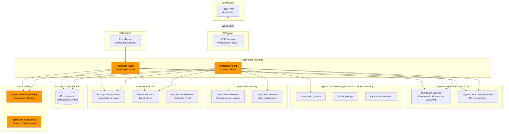
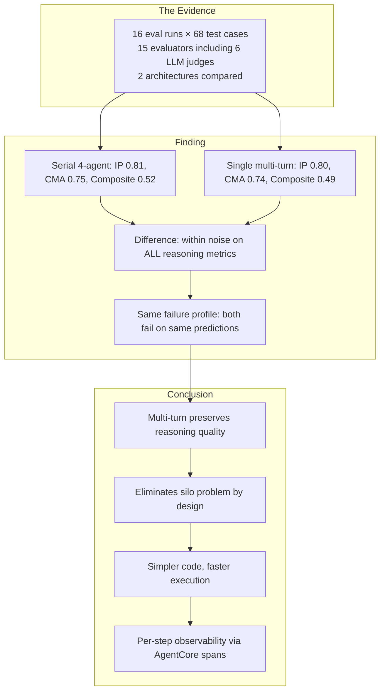
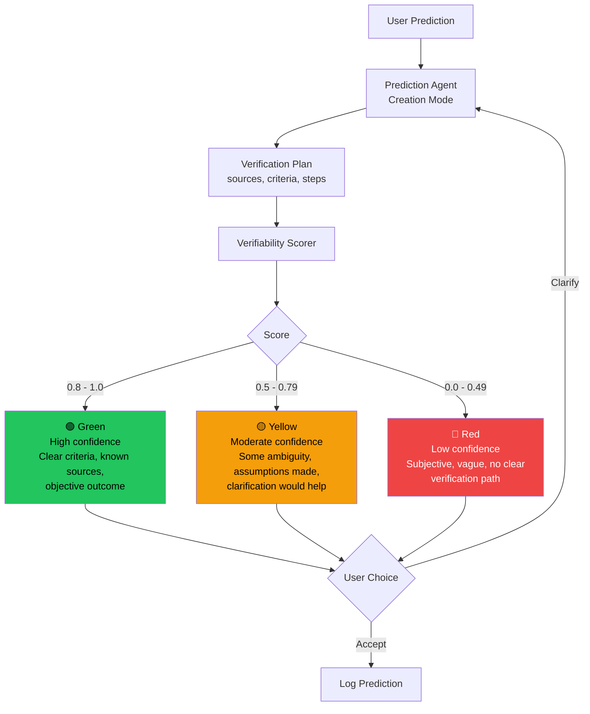
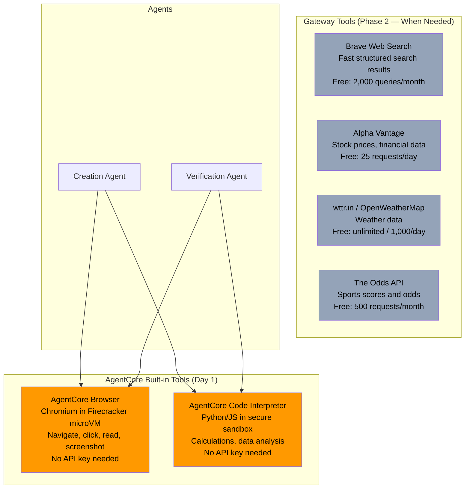
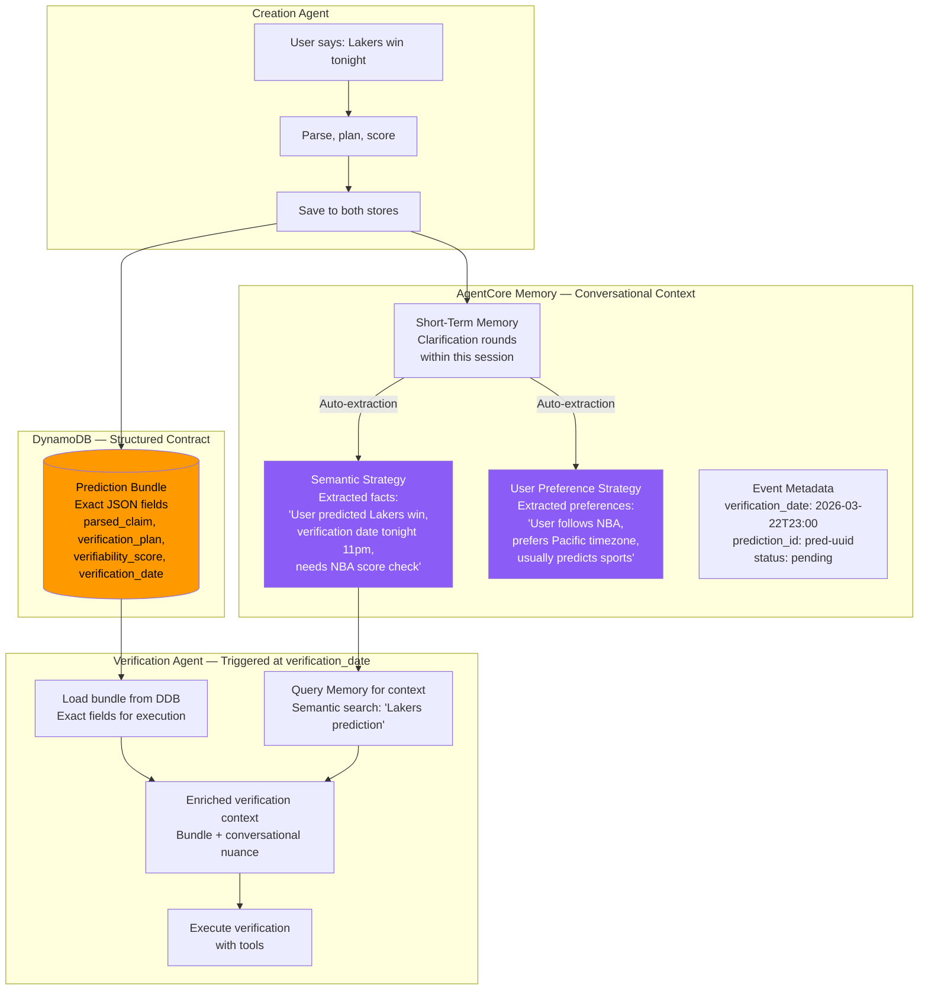
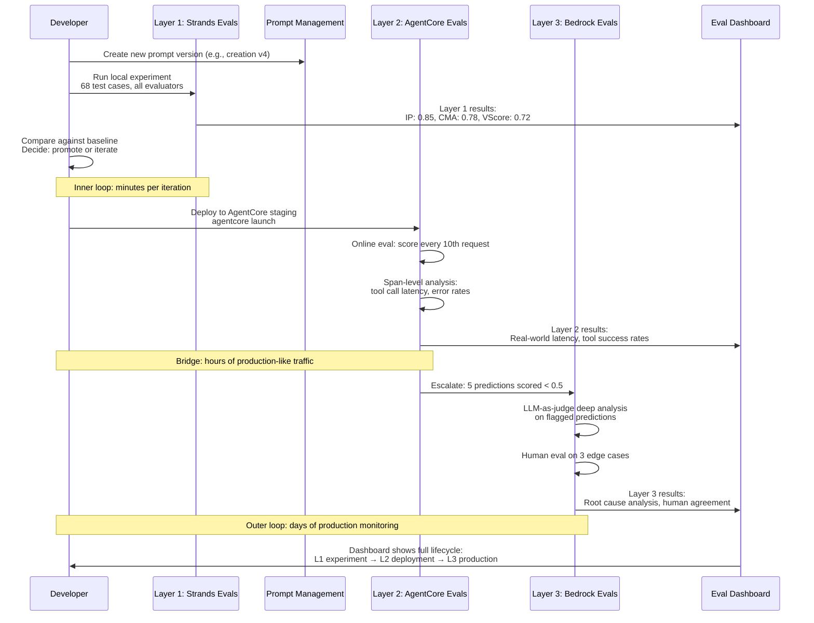
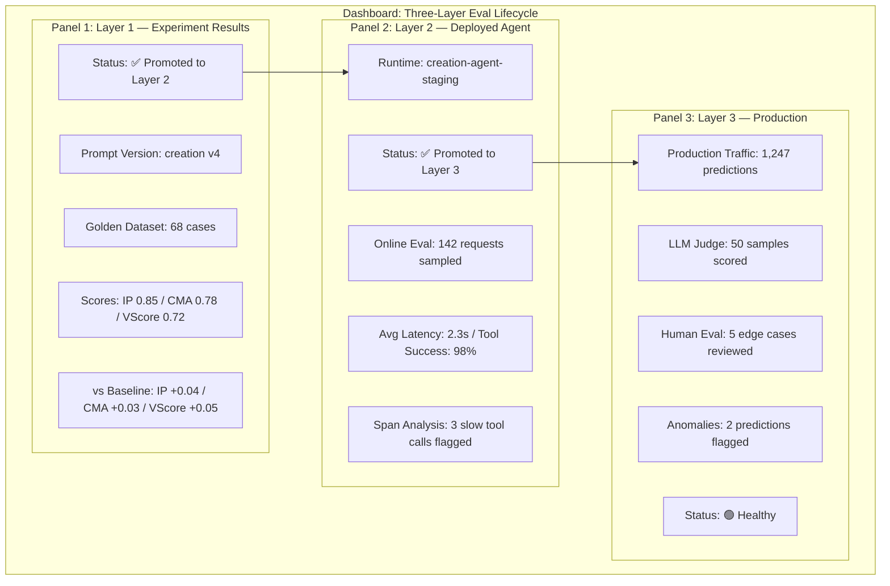
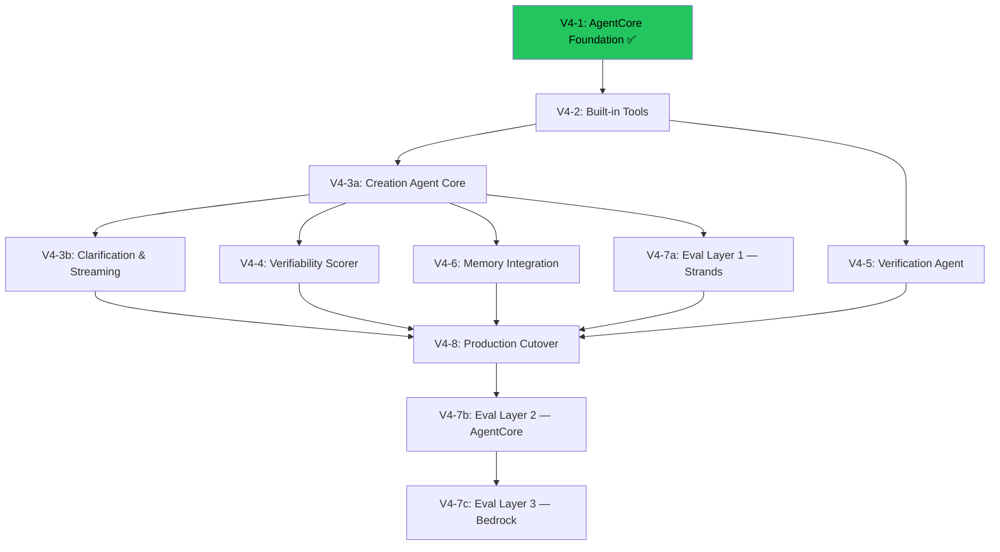

# CalledIt v4: AgentCore Architecture — Clean Rebuild

> Zero technical debt. Built with Bedrock AgentCore, not against it.

---

## Three Architectural Insights Driving v4

### Insight 1: Two Agents, Shared Infrastructure

The prediction creation agent and the verification agent share the same domain (understanding predictions and their verifiability) but have fundamentally different jobs:

1. **Creation Agent** — collaborative, user-facing. Parses natural language, builds a verification plan, scores verifiability, and interacts with the user through clarification rounds to produce the best possible prediction bundle.
2. **Verification Agent** — investigative, autonomous. Runs at `verification_date`, consumes the prediction bundle from DDB, gathers real evidence using tools, and produces a verdict (confirmed/refuted/inconclusive).

They share the same model, the same tools (via AgentCore Gateway), the same DDB prediction bundle as their contract, and the same Prompt Management infrastructure. But they are separate AgentCore Runtime deployments with separate prompts, separate scaling, and separate observability.

This is an intentional architectural decision, not a shortcut. See the "Why Two Agents, Not One" section below for the full rationale.

### Insight 2: Verifiability Strength, Not Categories

The 3-category system (auto_verifiable / automatable / human_only) is the wrong abstraction. What we actually want is a continuous confidence score — like a password strength indicator — that tells the user: "How likely is the future verification agent to confidently determine true/false based on what you've given it?"

- 🟢 Green: High confidence the verification agent will succeed
- 🟡 Yellow: Moderate confidence — clarification would help
- 🔴 Red: Low confidence — prediction is too vague, subjective, or lacks verifiable criteria

The user sees this indicator after round 1 and can choose to do more clarification rounds to push it toward green.

### Insight 3: Three-Layer Eval Architecture

- **Strands Evals SDK** — inner loop (dev-time, local experiments, prompt iteration)
- **Bedrock Evaluations** — outer loop (production, LLM-as-judge at scale, human eval)
- **AgentCore Evaluations** — bridge (span-level analysis on deployed agents, online + on-demand)

---

## v4 Architecture Overview



---

## Two Agents, Shared Infrastructure

```mermaid
stateDiagram-v2
    [*] --> CreationAgent: User submits prediction

    state CreationAgent {
        Parse --> BuildPlan
        BuildPlan --> ScoreVerifiability
        ScoreVerifiability --> PresentToUser
        PresentToUser --> UserDecides

        state UserDecides <<choice>>
        UserDecides --> Clarify: User wants to improve score
        UserDecides --> LogPrediction: User accepts
        Clarify --> Parse: With clarification context
    end

    LogPrediction --> DynamoDB: Save prediction bundle
    DynamoDB --> Scheduled: verification_date in future
    DynamoDB --> ImmediateVerify: verification_date is now/past

    state VerificationAgent {
        LoadBundle --> ExecutePlan
        ExecutePlan --> GatherEvidence
        GatherEvidence --> ProduceVerdict
    end

    Scheduled --> VerificationAgent: EventBridge triggers at verification_date
    ImmediateVerify --> VerificationAgent: Verify inline

    VerificationAgent --> Result: confirmed / refuted / inconclusive

```

### Why Two Agents, Not One

This was a deliberate architectural decision. Here's the analysis:

**Option A: Single agent with mode flag** — One `agentcore launch`, payload includes `"mode": "creation"` or `"mode": "verification"`.

**Option B: Two separate agents** — Two `agentcore launch` deployments, each with their own entrypoint, prompt, scaling, and observability.

We chose Option B for these reasons:

| Concern | Single Agent (Option A) | Two Agents (Option B) |
|---------|------------------------|----------------------|
| Prompts | One prompt with conditional sections — makes both modes worse | Focused prompts optimized for each job |
| Memory | Creation needs STM + LTM; verification is stateless — awkward to configure both | Each agent gets exactly the memory config it needs |
| Scaling | User-facing traffic and batch verification compete for the same instances | Creation scales with users, verification scales with EventBridge batch size |
| Observability | Traces mix creation and verification spans — harder to analyze | Clean separation in AgentCore Observability |
| Eval | One eval framework trying to measure two different jobs | Each agent has evaluators tuned to its specific job |
| Cold starts | Verification mode pays for creation mode's memory hooks on every cold start | Each agent loads only what it needs |

**AgentCore alignment:** This matches the recommended multi-agent pattern from AgentCore docs — separate runtimes with independent scaling, each with a focused `@app.entrypoint`. The multi-agent CloudFormation template demonstrates exactly this: orchestrator + specialist as separate deployments.

**What they share (via infrastructure, not code coupling):**
- Same model (Claude Sonnet 4 via Bedrock)
- Same tools (brave_web_search, fetch via AgentCore Gateway)
- Same DDB table (prediction bundle is the contract)
- Same Prompt Management stack (separate prompts, same versioning)
- Same eval methodology (different evaluators, same framework)

### Creation Agent vs Verification Agent

```mermaid
graph LR
    subgraph "Shared Infrastructure"
        MODEL[Claude Sonnet 4<br/>via Bedrock]
        TOOLS[AgentCore Built-in Tools<br/>Browser + Code Interpreter]        DDB[(DynamoDB<br/>Prediction Bundles)]
        PM[Bedrock Prompt Management]
    end

    subgraph "Creation Agent — AgentCore Runtime #1"
        direction TB
        CP1[Turn 1: Parse Prompt]
        CP2[Turn 2: Build Plan Prompt]
        CP3[Turn 3: Score Verifiability Prompt]
        CP4[Turn 4: Review Prompt]
        CP1 -->|conversation history| CP2
        CP2 -->|conversation history| CP3
        CP3 -->|conversation history| CP4
        MEM1[AgentCore Memory<br/>STM + LTM]
        SAVE[Save Bundle]
    end

    subgraph "Verification Agent — AgentCore Runtime #2"
        VP[Verification Prompt]
        LOAD[Load Bundle]
        EXEC[Execute + Gather Evidence]
        VERDICT[Produce Verdict]
    end

    MODEL --> CP1
    MODEL --> VP
    TOOLS --> CP2
    TOOLS --> VP
    PM --> CP1
    PM --> CP2
    PM --> CP3
    PM --> CP4
    PM --> VP
    SAVE --> DDB
    DDB --> LOAD

    style CP1 fill:#3b82f6,color:#fff
    style CP2 fill:#3b82f6,color:#fff
    style CP3 fill:#3b82f6,color:#fff
    style CP4 fill:#3b82f6,color:#fff
    style VP fill:#8b5cf6,color:#fff
```

### Single Agent, Multi-Turn Prompts (Decision 94)

The creation agent is one Strands Agent that processes 4 sequential prompt turns. Each turn is a separate versioned prompt in Bedrock Prompt Management. The agent sees its full conversation history at each step — no silo problem, no context loss.

This architecture was chosen based on experimental data from 16 eval runs:



**How the 4 turns work:**

| Turn | Prompt (from Prompt Management) | Input | Output |
|------|------|-------|--------|
| 1. Parse | `calledit-creation-parse` | Raw prediction text + current date | Structured claim + date reasoning |
| 2. Build Plan | `calledit-creation-plan` | (conversation history) + tool manifest | Verification plan (sources, criteria, steps) |
| 3. Score | `calledit-creation-score` | (conversation history) | Verifiability score (0.0-1.0) + reasoning per dimension |
| 4. Review | `calledit-creation-review` | (conversation history) | Clarification questions targeting plan assumptions |

Each turn's prompt says "Here is what you've done so far. Now do this next step." The agent naturally builds on its own reasoning because it sees the full conversation.

### What Gets Saved to DDB (The Prediction Bundle)

The prediction bundle is the contract between creation mode and verification mode. Everything the verification agent needs to do its job must be in this bundle.

```json
{
    "prediction_id": "pred-uuid",
    "user_id": "user-123",
    "raw_prediction": "Lakers win tonight",
    "parsed_claim": {
        "statement": "The Los Angeles Lakers will win their NBA game tonight",
        "verification_date": "2026-03-22T23:00:00Z",
        "date_reasoning": "Tonight refers to this evening, NBA games typically end by 11pm"
    },
    "verification_plan": {
        "sources": ["NBA scores API", "brave_web_search"],
        "criteria": [
            "Lakers final score > opponent final score in tonight's game"
        ],
        "steps": [
            "Search for tonight's Lakers game schedule to confirm they play",
            "After game completion, search for final score",
            "Compare Lakers score to opponent score"
        ]
    },
    "verifiability_score": 0.92,
    "verifiability_reasoning": "Clear factual claim with specific team, specific timeframe, objective win/loss outcome. NBA scores are publicly available via web search.",
    "clarification_rounds": 0,
    "created_at": "2026-03-22T18:30:00Z",
    "status": "pending",
    "prompt_versions": {
        "creation": "3",
        "scorer": "1"
    }
}
```

---

## Verifiability Strength Indicator

Replaces the 3-category system with a continuous score.



### What the Scorer Evaluates

The scorer is a separate LLM call (lightweight, fast) that evaluates the verification plan against these dimensions:

| Dimension | Weight | What It Measures |
|-----------|--------|-----------------|
| Criteria Specificity | 30% | Are criteria measurable and unambiguous? |
| Source Availability | 25% | Do the planned sources actually exist and are they accessible? |
| Temporal Clarity | 20% | Is the verification date clear and the claim time-bound? |
| Outcome Objectivity | 15% | Is the outcome binary (true/false) or subjective? |
| Tool Coverage | 10% | Do available MCP tools cover the verification needs? |

The scorer returns a float (0.0 - 1.0) plus reasoning explaining each dimension. The frontend maps this to the green/yellow/red indicator.

### Why This Is Better Than Categories

| Old (Categories) | New (Strength Score) |
|---|---|
| Binary routing decision | Continuous quality signal |
| "auto_verifiable" gives false confidence | 0.72 tells you exactly how confident |
| User has no agency | User can choose to improve the score |
| Categorizer errors cascade | Score errors are visible and correctable |
| 3 buckets hide nuance | Score captures the full spectrum |

---

## AgentCore Built-in Tools: Browser + Code Interpreter

Instead of building Gateway infrastructure with external API dependencies, v4 starts with AgentCore's built-in tools. Zero API keys, zero external dependencies, zero Gateway setup.



### Why Built-in Tools First, Gateway Later

| Concern | Gateway + Brave (v3 approach) | Built-in Tools (v4 approach) |
|---------|------------------------------|------------------------------|
| External dependencies | Brave API key, npm packages | None — fully managed by AWS |
| Setup complexity | Gateway creation, OAuth, Lambda targets, IAM roles | `CodeInterpreter('us-west-2')` and `BrowserClient('us-west-2')` |
| Search capability | Brave returns structured snippets — fast | Browser navigates to search engine — slightly slower but works |
| JavaScript-heavy sites | Needs separate playwright tool | Browser handles natively |
| Numerical verification | Not possible | Code Interpreter runs Python calculations |
| URL fetching | Separate fetch tool needed | Browser navigates to URL directly |
| Cost | Brave free tier (2,000/month) | Included in AgentCore pricing |
| Spec complexity | V4-2 needs Gateway + OAuth + targets | V4-2 just wires built-in tools |

### What Each Built-in Tool Enables

**AgentCore Browser** covers:
- Web search (navigate to search engine, read results)
- URL fetching (navigate to any URL, read rendered content)
- JavaScript-heavy sites (full Chromium rendering)
- Form interaction (login, submit data)
- Screenshot evidence (visual proof of verification)

**AgentCore Code Interpreter** covers:
- Numerical verification ("S&P 500 up 5%" → calculate percentage change)
- Date calculations ("3 business days from now" → compute exact date)
- Data analysis (parse structured data, compare values)
- Statistical checks ("temperature above average" → compute average from data)

### When to Add Gateway (Phase 2)

Add Gateway tools when built-in tools become a bottleneck:
- If Browser is too slow for simple search queries → add Brave Search via Gateway
- If financial predictions need real-time data → add Alpha Vantage via Gateway
- If weather predictions need structured forecasts → add OpenWeatherMap via Gateway
- If sports predictions need live scores → add The Odds API via Gateway

Each Gateway addition graduates a class of predictions from "browser search" to "direct API call" — faster and more reliable for that specific domain.

---

## Hybrid Memory Model: AgentCore Memory + DynamoDB

The prediction bundle lives in two places, each serving a different purpose.



### Why Both, Not Just One

| Concern | DynamoDB Only | Memory Only | Hybrid (Our Choice) |
|---------|--------------|-------------|---------------------|
| Structured data precision | ✅ Exact JSON fields | ❌ Semantic approximation | ✅ DDB for precision |
| Conversational context | ❌ Loses clarification nuance | ✅ Full conversation history | ✅ Memory for context |
| User preferences across sessions | ❌ Would need custom code | ✅ LTM auto-extracts | ✅ Memory for preferences |
| Verification agent needs exact criteria | ✅ Loads exact bundle | ❌ Semantic search may miss fields | ✅ DDB for the contract |
| Future predictions benefit from past ones | ❌ No cross-prediction learning | ✅ Semantic search finds patterns | ✅ Memory for learning |
| EventBridge trigger payload | ✅ prediction_id → DDB lookup | ❌ No direct lookup by ID | ✅ DDB for trigger |
| AgentCore pattern alignment | ❌ Custom storage, not AgentCore-native | ✅ Fully AgentCore-native | ✅ Both patterns used correctly |

### How It Works in Practice

**Creation Agent saves to both stores:**

```python
# 1. Save structured bundle to DynamoDB (the contract)
ddb_table.put_item(Item={
    "PK": f"PRED#{prediction_id}",
    "SK": "BUNDLE",
    "parsed_claim": parsed_claim,
    "verification_plan": verification_plan,
    "verifiability_score": verifiability_score,
    "verification_date": verification_date,
    "status": "pending"
})

# 2. Save conversation to AgentCore Memory (the context)
#    This happens automatically via AgentCoreMemorySessionManager
#    The session_manager saves every turn, and LTM strategies
#    auto-extract facts and preferences
```

**Verification Agent loads from both:**

```python
# 1. Load exact bundle from DynamoDB
bundle = ddb_table.get_item(Key={"PK": f"PRED#{prediction_id}", "SK": "BUNDLE"})

# 2. Optionally enrich with Memory context
#    Semantic search for related context the creation agent discussed
memories = memory_client.retrieve_memories(
    memory_id=MEMORY_ID,
    namespace=f"/predictions/{actor_id}/",
    query=bundle["parsed_claim"]["statement"],
    top_k=3
)
# memories might include: "User clarified they meant regular season, not playoffs"
# This nuance isn't in the structured bundle but helps verification
```

### Memory Strategies for CalledIt

```python
# Memory resource with three strategies
memory = memory_client.create_memory_and_wait(
    name="CalledIt_Predictions",
    strategies=[
        # Extract prediction facts for cross-prediction learning
        {"semanticMemoryStrategy": {
            "name": "PredictionFacts",
            "namespaces": ["/predictions/{actorId}/"]
        }},
        # Extract user preferences (timezone, sports teams, etc.)
        {"userPreferenceMemoryStrategy": {
            "name": "UserPreferences",
            "namespaces": ["/preferences/{actorId}/"]
        }},
        # Summarize clarification sessions
        {"summaryMemoryStrategy": {
            "name": "SessionSummaries",
            "namespaces": ["/summaries/{actorId}/{sessionId}/"]
        }}
    ],
    event_expiry_days=90
)
```

### What Each Strategy Enables

**Semantic (PredictionFacts):** When a user makes a new prediction about the Lakers, the creation agent can search Memory for past Lakers predictions — what worked, what didn't, what clarifications were needed. This makes the agent smarter over time without any custom code.

**User Preferences:** After a few predictions, Memory auto-extracts that the user follows NBA, lives in Pacific timezone, prefers specific weather thresholds for "nice weather." Future predictions get better defaults without asking.

**Session Summaries:** When the verification agent runs, it can retrieve a summary of the clarification session — "User initially said 'Lakers win' but clarified they meant regular season game against the Celtics, not the playoff series." This nuance helps verification accuracy.

### Event Metadata for Scheduling

```python
# When saving the prediction event, include metadata for future queries
memory_client.create_event(
    memory_id=MEMORY_ID,
    actor_id=user_id,
    session_id=prediction_session_id,
    messages=[
        (f"User predicted: {raw_prediction}", "USER"),
        (f"Prediction bundle created: {json.dumps(bundle)}", "ASSISTANT")
    ],
    metadata={
        "prediction_id": {"stringValue": prediction_id},
        "verification_date": {"stringValue": verification_date},
        "status": {"stringValue": "pending"},
        "verifiability_score": {"stringValue": str(verifiability_score)}
    }
)
```

This metadata enables future queries like "find all pending predictions for this user" using the `eventMetadata` filter on `list_events`.

---

## Three-Layer Eval Architecture (Dashboard Hero)

This is the centerpiece of the v4 eval story. The dashboard should make the three layers visible, showing how a prompt change flows from dev-time experiment → deployed agent validation → production monitoring.

```mermaid
graph TB
    subgraph "Layer 1: Inner Loop — Strands Evals SDK"
        direction TB
        L1A[Local development<br/>agentcore dev + invoke]
        L1B[Prompt iteration experiments<br/>Golden dataset, 68 test cases]
        L1C[Architecture comparison<br/>Pluggable backends]
        L1D[Evaluators: OutputEvaluator,<br/>TrajectoryEvaluator, Custom]
        L1E[Fast feedback: minutes<br/>Run locally, iterate fast]
    end

    subgraph "Layer 2: Bridge — AgentCore Evaluations"
        direction TB
        L2A[Deployed agent evaluation<br/>agentcore launch + real traffic]
        L2B[Span-level trace analysis<br/>Per-tool, per-step visibility]
        L2C[Online eval: every Nth request<br/>Continuous quality sampling]
        L2D[On-demand eval: triggered runs<br/>Post-deploy validation]
        L2E[Production-like: real latency,<br/>real tool responses]
    end

    subgraph "Layer 3: Outer Loop — Bedrock Evaluations"
        direction TB
        L3A[Production quality monitoring<br/>Aggregate trends over time]
        L3B[LLM-as-judge at scale<br/>Opus 4.6 scoring production samples]
        L3C[Human evaluation<br/>Edge cases, subjective quality]
        L3D[Custom metrics<br/>Verifiability score accuracy]
        L3E[Compliance and safety<br/>Content policy checks]
    end

    L1E -->|"Promote validated<br/>prompts + config"| L2A
    L2E -->|"Escalate anomalies<br/>for deep analysis"| L3A

    style L1A fill:#3b82f6,color:#fff
    style L1B fill:#3b82f6,color:#fff
    style L1C fill:#3b82f6,color:#fff
    style L1D fill:#3b82f6,color:#fff
    style L1E fill:#3b82f6,color:#fff
    style L2A fill:#8b5cf6,color:#fff
    style L2B fill:#8b5cf6,color:#fff
    style L2C fill:#8b5cf6,color:#fff
    style L2D fill:#8b5cf6,color:#fff
    style L2E fill:#8b5cf6,color:#fff
    style L3A fill:#ff9900,color:#000
    style L3B fill:#ff9900,color:#000
    style L3C fill:#ff9900,color:#000
    style L3D fill:#ff9900,color:#000
    style L3E fill:#ff9900,color:#000
```



### The Eval Lifecycle: From Prompt Change to Production Confidence



### Dashboard: Three-Layer Eval View (The Hero Page)

The dashboard's hero page shows the complete eval lifecycle for any prompt version or configuration change. This is what makes the eval framework a portfolio centerpiece.



### How Evaluators Map Across Layers

| Evaluator | Layer 1 (Strands Evals) | Layer 2 (AgentCore Evals) | Layer 3 (Bedrock Evals) |
|---|---|---|---|
| IntentPreservation | OutputEvaluator with rubric | Span-level on creation traces | LLM-as-judge on production samples |
| VerifiabilityScore accuracy | Custom evaluator (score vs actual verification outcome) | Online eval every 10th request | Human eval on edge cases |
| Tool usage efficiency | TrajectoryEvaluator (tool sequence, parameters) | Span-level tool call analysis (latency, errors) | — |
| Verification success rate | Custom (plan vs outcome on golden dataset) | On-demand after verification batch runs | Aggregate quality monitoring |
| Clarification quality | OutputEvaluator (are questions specific and useful?) | — | Human eval for subjective quality |
| Plan-execution fidelity | ToolAlignment + SourceAccuracy (deterministic) | Span-level comparison (planned vs actual tools) | — |
| End-to-end prediction quality | Composite score (weighted evaluators) | Online composite on sampled requests | LLM-as-judge + human agreement rate |

### Layer 1 Detail: Strands Evals SDK

This is the existing eval framework, upgraded for v4's two-agent architecture.

**Creation Agent evaluators:**
- IntentPreservation (OutputEvaluator) — does the verification plan preserve the user's intent?
- VerifiabilityScoreAccuracy (Custom) — does the score predict actual verification success?
- ClarificationQuality (OutputEvaluator) — are clarification suggestions specific and useful?
- PlanCompleteness (OutputEvaluator) — does the plan have sufficient sources, criteria, steps?
- ToolSelection (TrajectoryEvaluator) — did the agent reference appropriate tools?

**Verification Agent evaluators:**
- VerificationAccuracy (Custom) — did the agent reach the correct verdict?
- ToolAlignment (Custom deterministic) — planned tools vs actually used tools
- SourceAccuracy (Custom deterministic) — planned sources vs actually consulted sources
- EvidenceQuality (OutputEvaluator) — is the gathered evidence sufficient for the verdict?
- AdaptiveReasoning (OutputEvaluator) — when the plan was insufficient, did the agent adapt?

**Cross-agent evaluators:**
- BundleFidelity (Custom) — does the verification agent successfully consume the creation agent's bundle?
- ScorePredictiveness (Custom) — correlation between verifiability score and verification success

### Layer 2 Detail: AgentCore Evaluations

AgentCore Observability provides span-level tracing on deployed agents. Layer 2 uses this data for:

- **Online evaluation**: Score every Nth request automatically. The scoring uses the same evaluator rubrics from Layer 1, but runs against real production-like traffic instead of golden dataset cases.
- **Span-level analysis**: Per-tool-call latency, error rates, retry patterns. Identifies which tools are bottlenecks.
- **On-demand evaluation**: Triggered after a deployment or prompt change. Runs a curated test suite against the deployed agent.
- **Anomaly detection**: Flag requests where the verifiability score is unusually low or tool calls fail unexpectedly.

### Layer 3 Detail: Bedrock Evaluations

The outer loop for production confidence:

- **LLM-as-judge at scale**: Opus 4.6 scores a sample of production predictions using the same rubrics. This catches quality drift that Layer 2's automated checks might miss.
- **Human evaluation**: For edge cases flagged by Layer 2 or Layer 3's LLM judge. Human evaluators assess whether the prediction bundle would actually enable successful verification.
- **Custom metrics**: Verifiability score accuracy measured against actual verification outcomes over time. This is the empirical grounding for composite score weights (Decision 62).
- **Trend monitoring**: Aggregate quality metrics over days/weeks. Detects gradual degradation that per-request checks miss.

---

## What Carries Forward vs What Gets Rebuilt

### Carries Forward (Proven Value)
- Golden dataset (68 test cases with ground truth metadata)
- Evaluator rubrics (the scoring criteria, not the code)
- Prompt text (from Bedrock Prompt Management, already versioned)
- DynamoDB schema patterns (predictions table, eval reasoning table)
- Frontend (React PWA, WebSocket streaming, clarification UI)
- 85 architectural decisions (institutional knowledge)
- Eval methodology (isolated single-variable testing, composite scoring)

### Gets Rebuilt (Clean Slate on AgentCore)
- Agent code → two separate agents with BedrockAgentCoreApp wrappers (creation + verification)
- MCP tool hosting → AgentCore Gateway (Lambda targets, not subprocess)
- Session state → AgentCore Memory (STM + LTM) on creation agent only
- Categorizer → Verifiability Scorer (continuous score, not categories)
- Verification executor → dedicated verification agent (separate AgentCore Runtime)
- Lambda handler → two AgentCore Runtime entrypoints
- Eval runner → three-layer architecture (Strands + AgentCore + Bedrock)
- Observability → AgentCore Observability (replaces custom OTEL)

### Gets Removed (Technical Debt Eliminated)
- Docker Lambda with Node.js (no more MCP subprocesses)
- MCP Manager module (Gateway handles tool lifecycle)
- 4 separate agent factory modules (two focused agents replace four)
- Strands Graph (no graph needed — creation agent is a single agent, not a pipeline)
- Hardcoded prompt fallback constants (Prompt Management is the source of truth)
- Verification scanner Lambda (EventBridge invokes verification agent directly)
- SnapStart configuration (AgentCore manages cold starts)

---

## AgentCore Entrypoints

### Creation Agent (`creation_agent.py`)

> **Note:** This is the target architecture for V4-3a+. V4-1 proved the foundation pattern works.
> The actual V4-1 entrypoint is simpler (no memory, no prompt_client, no clarification rounds).
> See `calleditv4/src/main.py` for the current working code.

```python
"""
CalledIt v4 — Prediction Creation Agent on AgentCore
Handles user-facing prediction creation with clarification rounds.
"""
import json
import logging
import os

from bedrock_agentcore.runtime import BedrockAgentCoreApp
from strands import Agent
from strands.models.bedrock import BedrockModel
from strands_tools.browser import AgentCoreBrowser
from strands_tools.code_interpreter import AgentCoreCodeInterpreter

app = BedrockAgentCoreApp()
logger = logging.getLogger(__name__)

MODEL_ID = "us.anthropic.claude-sonnet-4-20250514-v1:0"
REGION = os.getenv("AWS_REGION", "us-west-2")

# Built-in tools (Day 1) — no API keys, no Gateway setup
browser_tool = AgentCoreBrowser(region=REGION)
code_interpreter_tool = AgentCoreCodeInterpreter(region=REGION)


@app.entrypoint
def handler(payload: dict, context: dict) -> str:
    """Creation agent entrypoint — receives prediction, returns bundle."""
    if "prompt" not in payload:
        return json.dumps({"error": "Missing 'prompt' field in payload"})

    prompt = payload["prompt"]

    try:
        # Prompt Management wiring comes in V4-3a
        # Memory integration comes in V4-6
        model = BedrockModel(model_id=MODEL_ID)
        agent = Agent(
            model=model,
            system_prompt="You are the CalledIt v4 creation agent.",  # Placeholder — Prompt Management in V4-3a
            tools=[browser_tool.browser, code_interpreter_tool.code_interpreter],
        )
        response = agent(prompt)
        return str(response)
    except Exception as e:
        logger.error(f"Agent invocation failed: {e}", exc_info=True)
        return json.dumps({"error": f"Agent invocation failed: {str(e)}"})


if __name__ == "__main__":
    app.run()
```

### Verification Agent (`verification_agent.py`)

> **Note:** This is the target architecture for V4-5. Built-in tools (Browser + Code Interpreter)
> replace the v3 MCP subprocess approach. No Gateway needed for Day 1.

```python
"""
CalledIt v4 — Prediction Verification Agent on AgentCore
Runs at verification_date to produce a verdict. No user interaction, no memory.
"""
import json
import logging
import os

from bedrock_agentcore.runtime import BedrockAgentCoreApp
from strands import Agent
from strands.models.bedrock import BedrockModel
from strands_tools.browser import AgentCoreBrowser
from strands_tools.code_interpreter import AgentCoreCodeInterpreter

app = BedrockAgentCoreApp()
logger = logging.getLogger(__name__)

MODEL_ID = "us.anthropic.claude-sonnet-4-20250514-v1:0"
REGION = os.getenv("AWS_REGION", "us-west-2")

# Built-in tools — same tools as creation agent, different usage pattern
browser_tool = AgentCoreBrowser(region=REGION)
code_interpreter_tool = AgentCoreCodeInterpreter(region=REGION)


@app.entrypoint
def handler(payload: dict, context: dict) -> str:
    """Verification agent entrypoint — receives bundle, returns verdict."""
    bundle = payload.get("prediction_bundle", {})
    if not bundle:
        return json.dumps({"error": "Missing 'prediction_bundle' in payload"})

    try:
        # Prompt Management wiring comes in V4-5
        model = BedrockModel(model_id=MODEL_ID)
        agent = Agent(
            model=model,
            system_prompt="You are the CalledIt v4 verification agent.",  # Placeholder
            tools=[browser_tool.browser, code_interpreter_tool.code_interpreter],
        )

        verification_prompt = (
            f"VERIFY THIS PREDICTION:\n"
            f"Claim: {bundle.get('parsed_claim', {}).get('statement', '')}\n"
            f"Verification Plan: {json.dumps(bundle.get('verification_plan', {}))}\n"
            f"Verifiability Score: {bundle.get('verifiability_score', 'unknown')}\n\n"
            f"Use your tools to gather evidence and determine: confirmed, refuted, or inconclusive."
        )

        response = agent(verification_prompt)
        return str(response)
    except Exception as e:
        logger.error(f"Verification failed: {e}", exc_info=True)
        return json.dumps({"error": f"Verification failed: {str(e)}"})


if __name__ == "__main__":
    app.run()
```

---

## Migration Sequence

> **Updated March 22, 2026:** Reflects the 11-spec plan (Decision 92) and V4-1 completion.



### Spec Status

| Spec | Name | Status | Validates |
|------|------|--------|-----------|
| V4-1 | AgentCore Foundation | ✅ COMPLETE | `agentcore create`, dev server, basic invoke, config |
| V4-2 | Built-in Tools | NEXT | Browser + Code Interpreter wired, basic verification |
| V4-3a | Creation Agent Core | Pending | Prediction in → bundle out, Prompt Management, DDB save |
| V4-3b | Clarification & Streaming | Pending | Multi-round clarification, WebSocket streaming |
| V4-4 | Verifiability Scorer | Pending | Continuous 0.0-1.0 score, 5 dimensions |
| V4-5 | Verification Agent | Pending | Separate runtime, DDB bundle load, verdict |
| V4-6 | Memory Integration | Pending | STM + 3 LTM strategies, session manager |
| V4-7a | Eval Layer 1 (Strands) | Pending | Golden dataset adapted, local eval runner |
| V4-7b | Eval Layer 2 (AgentCore) | Pending | Span-level eval, online scoring |
| V4-7c | Eval Layer 3 (Bedrock) | Pending | LLM-as-judge at scale, human eval |
| V4-8 | Production Cutover | Pending | Three-phase cutover, v3 teardown |

---

## Open Questions (Updated March 22, 2026)

1. ~~Should the verifiability scorer be a separate lightweight LLM call, or a section of the main agent's output that gets extracted?~~ **Answered (Decision 94):** It's Turn 3 of the 4-turn creation agent. Same agent, separate prompt from Prompt Management. The agent scores its own plan because it has full conversation context.

2. ~~How should the EventBridge scanner invoke the AgentCore agent in verification mode?~~ **Answered (Decision 86):** EventBridge → `InvokeAgentRuntime` API on the verification agent's separate AgentCore Runtime. This is Deviation 2 in the steering doc — valid use of the Runtime API, just not the typical interactive pattern.

3. Should we keep the existing DynamoDB table schema or redesign for the new bundle format? **Partially answered (Decision 95):** v3 predictions in DDB are handled gracefully — missing v4 fields (verifiability_score, verifiability_reasoning) treated as v3-era predictions. Full schema design is part of V4-3a.

4. ~~What's the right LTM extraction strategy?~~ **Answered (Decision 88):** Three strategies — semantic (prediction facts), user preferences, session summaries. Detailed in the Hybrid Memory Model section above.

5. ~~How do we handle the transition period where v3 predictions in DDB need to be verifiable by the v4 agent?~~ **Answered (Decision 95):** v3 stays live and untouched through V4-1 to V4-7a. V4-8 handles cutover in three phases. v3 predictions missing v4 fields are handled gracefully.

6. **NEW:** What IAM permissions does the dev identity need for Browser + Code Interpreter? V4-2 will determine the exact policy. The AgentCore docs specify `bedrock-agentcore:StartBrowserSession`, `InvokeCodeInterpreter`, etc.

7. **NEW:** Does `agentcore dev` support built-in tools locally, or do they require AWS API calls even in dev mode? V4-2 will test this — Browser and Code Interpreter run in AWS infrastructure (Firecracker microVMs), so they likely need real AWS credentials even during local dev.
